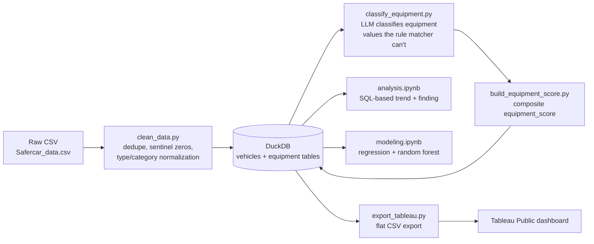
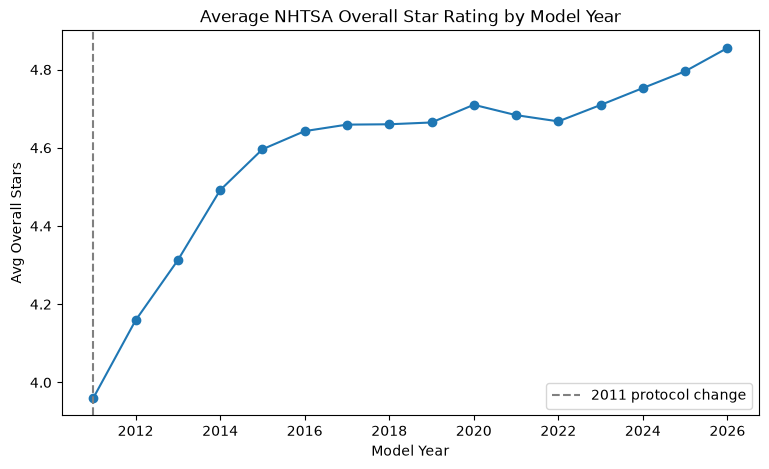
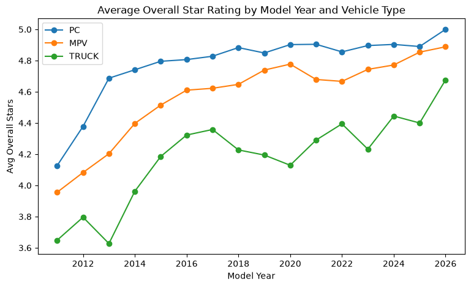

# NHTSA Vehicle Safety: Equipment & Crash-Test Trends

**Question:** How has vehicle safety equipment and crash-test performance changed over time, and does the equipment on a vehicle actually track its crash-test rating once you control for the era it was built in?

Built as a small end-to-end data pipeline over NHTSA's public vehicle safety dataset (1990–2026): raw CSV → cleaned/typed data → a local analytical database → LLM-assisted enrichment of messy free-text fields → analysis and modeling → a dashboard.

## Pipeline



## What's in each stage

- **`scripts/clean_data.py`** — cleans the raw CSV: removes duplicate rows, fixes placeholder values that were secretly standing in for missing data (e.g. a vehicle listed as weighing 0 lbs), and standardizes inconsistent category values (`DRIVE_TRAIN` had typos like `4x4` and `ADW` that both should read `AWD`). The cleaned data is split into two tables — one row per vehicle, and one row per vehicle-per-safety-feature — and loaded into a local database file (DuckDB), so every later step can query it with SQL instead of re-reading and re-cleaning the CSV each time.
- **`scripts/equipment_rules.py`** — a simple rule-based classifier: it matches equipment values like `"Standard"` or `"S"` to a 0/1/2 scale (not present / optional / standard). This handles about 94% of values on its own, but can't make sense of abbreviations, percentages, or garbled text (`"Optional?46??"`, `"Ab"`, `"S2"`).
- **`scripts/classify_equipment.py`** — for the values the rule-based classifier can't figure out, this sends them to Claude to classify instead. Every value is cached after its first classification so nothing is ever sent to the API twice, and Claude's answers are forced into a strict, valid format so a response is never garbled or unusable. It also has a `--validate` mode that checks the AI's accuracy against values we already know the right answer to, before trusting it on the rest — see [The LLM step](#the-llm-step-what-it-did-and-didnt-change) below.
- **`scripts/build_equipment_score.py`** — combines the rule-based and AI classifications into one composite `equipment_score` per vehicle (the average equipment level across every feature that got scored).
- **`notebooks/analysis.ipynb`** — analyzes the data with SQL queries run directly against the database, to build the trend charts and test whether equipment score actually tracks crash-test rating.
- **`notebooks/modeling.ipynb`** — builds two prediction models (a linear regression and a random forest) that predict a vehicle's crash-test star rating from its equipment score, model year, and vehicle type. See [Modeling](#modeling) below.
- **`scripts/export_tableau.py`** — exports a single flat CSV for the Tableau dashboard, since Tableau Public can only read files, not connect to a database directly.

## Key charts

**Average overall crash-test star rating by model year** (star ratings only exist from 2011 onward — NHTSA's revised 5-Star protocol):



**Same trend, split by vehicle type** (filtered to `PC`/`MPV`/`TRUCK`, the only categories with real volume):



**Interactive dashboard:** [View on Tableau Public](https://public.tableau.com/app/profile/eric.jung1941/viz/NHTSAVehicleSafetyTrendsCrashRatingsEquipmentScore/NHTSAVehicleSafetyTrendsCrashRatingsEquipmentScore) — same two trends, filterable by vehicle type, with an equipment-score view alongside the star-rating view.

## The LLM step: what it did and didn't change

Before trusting Claude's classifications, I tested it on 40 values the rule-based classifier already handles correctly, to see how often the two agreed: **97.5% of the time**. The one disagreement actually caught a real mistake in my own logic — I'd assumed a bare `"A"` meant "standard equipment," but it shows up 422 times for ABS alone, and Claude read it as "available/optional" instead. That makes more sense: the rule-based classifier had no way to tell `"A"` apart from `"Std"` or `"S"`, it was just guessing. I fixed the rule-based classifier to stop guessing on that value and let the AI handle it going forward.

Beyond that one fix, the rule-based classifier alone couldn't figure out about **6% of the equipment values used for scoring (10,395 rows)** — including *every* value for ABS, `SEAT_BELT_PRETENSIONER`, and `DAY_RUN_LIGHTS` that had any abbreviation or odd formatting. Adding the AI classification step brought that down to **0% unresolved**.

**Honest caveat:** even with full coverage, the AI step barely moved the *overall* equipment score — on average, adding it changed a vehicle's score by only about 0.014 points on a 0–2 scale. Its real value wasn't shifting the headline number, it was filling in the gaps completely and fixing specific mistakes like the `"A"` example above.

## Finding

Pooling all years, equipment score barely correlates with `OVERALL_STARS` (r ≈ 0.06) — but that pooled number is misleading. Broken out by 5-year model-year windows, the relationship actually **flips sign over time**: negative in 2010–2014, near zero in 2015–2019, and positive in 2020 onward. A single overall correlation would have hidden that shift entirely, which is why the notebook checks it within time windows rather than reporting one pooled number.

## Modeling

`notebooks/modeling.ipynb` predicts `OVERALL_STARS` from `equipment_score`, `MODEL_YR`, and `VEHICLE_TYPE`:

| Model | R² | MAE |
|---|---|---|
| Linear regression | 0.245 | 0.39 stars |
| Random forest | 0.363 | 0.34 stars |

Both are modest — as expected, given the weak/mixed correlation above. The interesting part is *why*: the linear regression's `equipment_score` coefficient is **negative** (-0.31) once `VEHICLE_TYPE` and `MODEL_YR` are held constant, which looks backwards until you notice it's confounding by vehicle segment — trucks have both lower equipment scores and lower star ratings than passenger cars, so once the model has a `VEHICLE_TYPE_TRUCK` term to absorb that segment effect, what's left in `equipment_score` behaves differently. The random forest's feature importances back this up: `MODEL_YR` alone explains the largest share of predictive power (0.38) — most of the safety improvement over time is a general trend, not equipment specifically — with `equipment_score` (0.27) and `VEHICLE_TYPE_TRUCK` (0.27) contributing roughly equal, overlapping shares. Full reasoning and next-step ideas (e.g. a segment/era fixed-effects design) are in the notebook's conclusion.

## Results

Putting the trend, correlation, and modeling analyses together: **crash-test safety improved substantially and consistently across every vehicle type from 2011 to 2026 — but that improvement mostly reflects the passage of time itself, not the specific equipment measured here.** `MODEL_YR` alone is the single strongest predictor of star rating in the random forest, meaning most of the safety gain is an industry-wide trend (better structural engineering, updated crash standards over the years) rather than something driven by any one equipment feature.

`equipment_score` does carry real signal, but it's entangled with vehicle segment rather than acting as an independent predictor. Trucks consistently have both lower equipment scores *and* lower star ratings than passenger cars — so once a model accounts for vehicle type, equipment score's apparent relationship with safety changes, even flipping sign in the linear regression. The same pattern shows up in the correlation analysis, where equipment score's relationship with star rating flips from negative (2010–2014) to positive (2020 onward) depending on the era.

**So, answering the original question directly: no — equipment doesn't cleanly track crash-test rating once you control for era.** What looks like an "equipment effect" is mostly standing in for two other things: general improvement over time, and vehicle segment. That's a more honest conclusion than a simple yes or no, and a more useful one — it points to what would actually need to be modeled (comparisons within the same segment and era) to isolate a real equipment effect, rather than claiming this analysis already found one.

## Caveats

- Star ratings and equipment presence are only available for a subset of vehicles (~5,500 of 17,310 after cleaning) — the crash-test program doesn't cover every model/year in the dataset.
- `equipment_score` covers a curated set of ~23 equipment columns that fit a clean standard/optional/absent scale (see `CORE_FEATURES` in `equipment_rules.py`); columns describing *where* equipment is mounted or NHTSA's own recommendation ratings are excluded, since those don't fit the same scale.
- The raw `VEHICLE_TYPE` field is inconsistent (some vehicles are coded as body styles like `"4 DR"` instead of a vehicle type) — the dashboard and notebook filter to the three categories with real volume (`PC`, `MPV`, `TRUCK`).

## Running it locally

`data/equipment_llm_cache.json` (the LLM's classifications, not a secret) is committed to the repo, so `build_equipment_score.py`, `analysis.ipynb`, and `modeling.ipynb` all reproduce the exact same results **without needing an Anthropic API key**. A key is only required if you want to rerun `classify_equipment.py` itself — e.g. on new data, or to see the classification step happen live.

```bash
python3 -m venv .venv && source .venv/bin/activate
pip install -r requirements.txt

python scripts/clean_data.py              # raw CSV -> DuckDB
python scripts/build_equipment_score.py   # build the composite score (uses the committed LLM cache)
python scripts/export_tableau.py          # export for Tableau

jupyter execute --inplace notebooks/analysis.ipynb    # or open it interactively
jupyter execute --inplace notebooks/modeling.ipynb

# Only needed to rerun the LLM classification step itself:
export ANTHROPIC_API_KEY=sk-ant-...
python scripts/classify_equipment.py --validate 40   # optional: check agreement first
python scripts/classify_equipment.py                 # classify the residual
```
