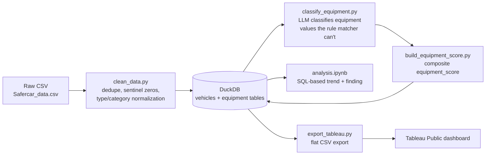

# NHTSA Vehicle Safety: Equipment & Crash-Test Trends

**Question:** How has vehicle safety equipment and crash-test performance changed over time, and does the equipment on a vehicle actually track its crash-test rating once you control for the era it was built in?

Built as a small end-to-end data pipeline over NHTSA's public vehicle safety dataset (1990–2026): raw CSV → cleaned/typed data → a local analytical database → LLM-assisted enrichment of messy free-text fields → analysis → a dashboard.

## Pipeline



## What's in each stage

- **`scripts/clean_data.py`** — reads the raw CSV, drops exact duplicates, converts sentinel zeros (e.g. `CURB_WEIGHT == 0`) to true nulls, normalizes messy categorical fields (`DRIVE_TRAIN` typos like `4x4`/`ADW`, `BODY_FRAME` casing), and splits the result into a wide `vehicles` table and a long/tidy `equipment` table (one row per vehicle × equipment feature), loaded into a local DuckDB file at `data/nhtsa.duckdb`.
- **`scripts/equipment_rules.py`** — a keyword-based classifier that maps equipment values like `"Standard"`, `"S"`, `"Optional"` to a 0/1/2 (not present / optional / standard) scale. Resolves ~94% of the equipment values in the columns that matter for scoring, but can't handle abbreviations, percentages, or OCR-noise fragments (`"Optional?46??"`, `"Ab"`, `"S2"`).
- **`scripts/classify_equipment.py`** — sends the values the rule matcher can't handle to Claude (batched, cached to `data/equipment_llm_cache.json` so no string is ever billed twice), using structured outputs so every response is guaranteed valid JSON. Includes a `--validate` mode that reruns the LLM on values the rule matcher *can* already handle, to measure agreement before trusting it on the rest.
- **`scripts/build_equipment_score.py`** — combines the rule-based and LLM classifications into a per-vehicle composite `equipment_score` (mean equipment level across the scored features).
- **`notebooks/analysis.ipynb`** — queries DuckDB directly with SQL (no re-reading or re-cleaning the CSV) for the trend charts, and includes the equipment-score-vs-crash-rating analysis below.
- **`scripts/export_tableau.py`** — denormalizes the DuckDB tables into a flat CSV for the Tableau Public dashboard (Tableau Public only connects to flat files, not a database).

## Key charts

**Average overall crash-test star rating by model year**, with NHTSA's 2011 protocol change marked:


**Same trend, split by vehicle type:**


**Interactive dashboard:** [View on Tableau Public](https://public.tableau.com/app/profile/eric.jung1941/viz/NHTSAVehicleSafetyTrends/NHTSAVehicleSafetyTrends) — same two trends, filterable by vehicle type, with an equipment-score view alongside the star-rating view.

## The LLM step: what it did and didn't change

Validated the LLM classifier against 40 values the rule matcher already handles: **97.5% agreement**. The one disagreement was real, not noise — the rule matcher assumed a bare `"A"` meant "standard equipment," but `"A"` shows up 422 times for ABS alone and the LLM read it as "available/optional," which the rule matcher had no way to tell apart from `"Std"`/`"S"`. That token was moved out of the rule matcher entirely so it's now handled by the LLM instead of a guess.

Across the equipment columns used for scoring, the rule matcher alone left **~6% of values (10,395 rows)** unclassified — including *all* of ABS, `SEAT_BELT_PRETENSIONER`, and `DAY_RUN_LIGHTS` values with any abbreviation or formatting quirk. The LLM step took that to 0% unresolved.

**Honest caveat:** the LLM step barely changed the *aggregate* equipment score (mean absolute difference of ~0.014 on a 0–2 scale between the rule-only and rule+LLM composite score) — its value was in completeness and fixing specific misclassifications, not in shifting the headline number.

## Finding

Pooling all years, equipment score barely correlates with `OVERALL_STARS` (r ≈ 0.06) — but that pooled number is misleading. Broken out by 5-year model-year windows, the relationship actually **flips sign over time**: negative in 2010–2014, near zero in 2015–2019, and positive in 2020 onward. A single overall correlation would have hidden that shift entirely, which is why the notebook checks it within time windows rather than reporting one pooled number.

## Caveats

- Star ratings and equipment presence are only available for a subset of vehicles (~5,500 of 17,310 after cleaning) — the crash-test program doesn't cover every model/year in the dataset.
- `equipment_score` covers a curated set of ~23 equipment columns that fit a clean standard/optional/absent scale (see `CORE_FEATURES` in `equipment_rules.py`); columns describing *where* equipment is mounted or NHTSA's own recommendation ratings are excluded, since those don't fit the same scale.
- The raw `VEHICLE_TYPE` field is inconsistent (some vehicles are coded as body styles like `"4 DR"` instead of a vehicle type) — the dashboard and notebook filter to the three categories with real volume (`PC`, `MPV`, `TRUCK`).

## Running it locally

```bash
python -m venv .venv && source .venv/bin/activate
pip install -r requirements.txt

python scripts/clean_data.py              # raw CSV -> DuckDB
export ANTHROPIC_API_KEY=sk-ant-...       # needed for the next two steps
python scripts/classify_equipment.py --validate 40   # optional: check agreement first
python scripts/classify_equipment.py                 # classify the residual
python scripts/build_equipment_score.py   # build the composite score
python scripts/export_tableau.py          # export for Tableau

jupyter execute --inplace notebooks/analysis.ipynb    # or open it interactively
```
